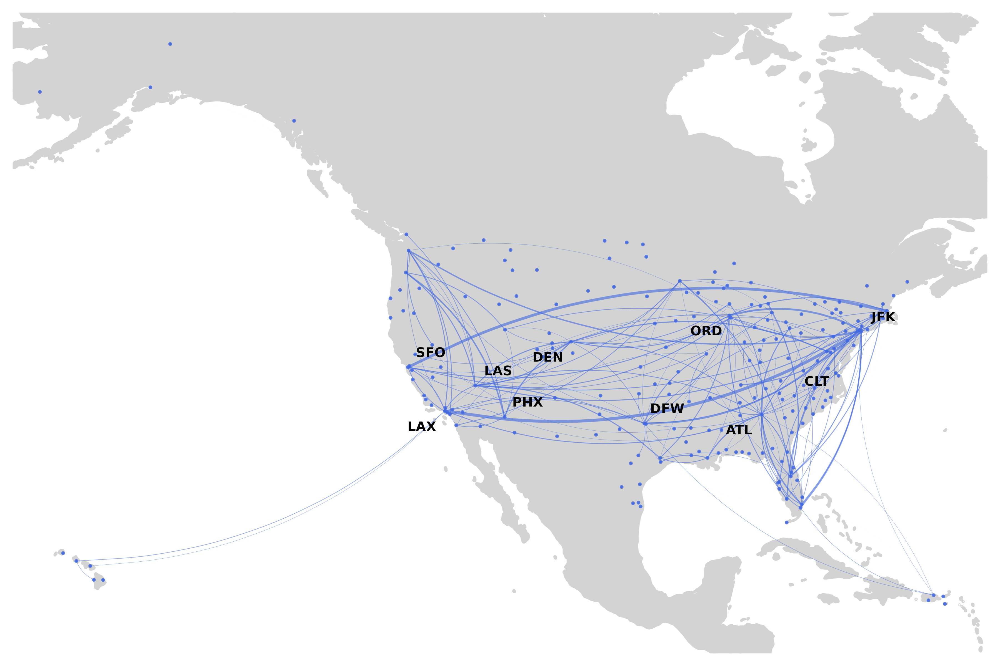

# Introduction to SKYNET

SKYNET is a flexible R package that allows generating bespoke air
transport statistics for urban studies based on publicly available data
from the Bureau of Transport Statistics (BTS) in the United States.

## SKYNET’s segments

SKYNET is effectively divided into four segments:

1.  Import Data
2.  Generate Air Networks
3.  Plot Air Networks

## Import Data

To import data, simply type
[`import_db1b()`](https://docs.ropensci.org/skynet/reference/import_db1b.md)
or
[`import_t100()`](https://docs.ropensci.org/skynet/reference/import_t100.md)
including the path to your desired file. Note: we recommend naming the
files with a similar structure as `Ticket 2016Q1.csv` or
`Coupon 2016Q1.csv` respectively.

``` r

 library(skynet)
 import_db1b("folder/Coupon 2016Q1.csv", "folder/Ticket 2016Q1.csv")
 import_t100("folder/T100_2016.csv")
```

The BTS DB1B data consists of 2 sets of files, `Coupon` and `Ticket`.
They can be both downloaded at
<https://www.transtats.bts.gov/DL_SelectFields.asp?Table_ID=289> and
<https://www.transtats.bts.gov/DL_SelectFields.asp?Table_ID=272>
respectively.

Despite being possible to download the complete zipped file, which
includes all variables, due to its size, we recommend selecting the
following set.

| Coupon                     | Ticket             |
|:---------------------------|:-------------------|
| Itinerary ID               | Itinerary ID       |
| Market ID                  | Roundtrip          |
| Sequence Number            | Itinerary Yield    |
| Origin City Market ID      | Passengers         |
| Origin                     | Itinerary Fare     |
| Year                       | Bulkfare Indicator |
| Quarter                    | Distance Full      |
| Destination City Market ID |                    |
| Destination                |                    |
| Trip Break                 |                    |
| Operating Carrier          |                    |
| Distance                   |                    |
| Gateway                    |                    |

Since version 1.0.2 that the import method changed being the
`netimport()` function no longer available. When importing from the
prezipped DB1B file, just add the argument `zip = TRUE` to the
[`import_db1b()`](https://docs.ropensci.org/skynet/reference/import_db1b.md)
function. This does not apply to the T100 file which can be simply
imported by typing
[`import_t100()`](https://docs.ropensci.org/skynet/reference/import_t100.md).
In order to save space, it is possible as well to import the prezipped
file, and convert it to a smaller file with only the necessary
variables, with the function `convert_raw()`.

When importing files from the T100 dataset, we recommend naming the file
as `T100 year mkt` for the Market dataset and `T100 year seg` for the
Segment dataset.

## Create networks

SKYNET creates three types of networks and an extra option:

1.  Directed Network -
    [`make_net_dir()`](https://docs.ropensci.org/skynet/reference/make_net_dir.md)
2.  Undirected Network -
    [`make_net_und()`](https://docs.ropensci.org/skynet/reference/make_net_und.md)
3.  Path Network -
    [`make_net_path()`](https://docs.ropensci.org/skynet/reference/make_net_path.md)
4.  Metro Network - To be used as argument in
    [`make_net_dir()`](https://docs.ropensci.org/skynet/reference/make_net_dir.md)
    and
    [`make_net_und()`](https://docs.ropensci.org/skynet/reference/make_net_und.md)
5.  International Option - `make_net_int()`

When generating a network, SKYNET, creates a list which includes:

1.  Dataframe from original data (example below)
2.  iGraph object
3.  Dataframe with nodes(airports) statistics

| itin_id | mkt_id | seq_num | origin_mkt_id | origin | dest_mkt_id | dest | trip_break | op_carrier | distance | year | quarter | gateway | roundtrip | itin_yield | passengers | itin_fare | bulk_fare | distance_full |
|---:|---:|---:|---:|:---|---:|:---|:---|:---|---:|---:|---:|---:|---:|---:|---:|---:|---:|---:|
| 201112367302 | 2.011124e+13 | 1 | 30713 | BOI | 32457 | SJC | X | WN | 523 | 2011 | 1 | 0 | 1 | 0.2132 | 1 | 223 | 0 | 1046 |
| 201112373990 | 2.011124e+13 | 3 | 30325 | DEN | 30977 | MDW |  | WN | 895 | 2011 | 1 | 0 | 1 | 0.1069 | 1 | 335 | 0 | 3135 |
| 201112643128 | 2.011126e+13 | 1 | 33667 | ORF | 31454 | MCO |  | WN | 655 | 2011 | 1 | 0 | 1 | 0.0744 | 1 | 366 | 0 | 4919 |
| 201112707542 | 2.011127e+13 | 1 | 31714 | RSW | 30693 | BNA |  | WN | 722 | 2011 | 1 | 0 | 0 | 0.0870 | 1 | 114 | 0 | 1310 |
| 201112477390 | 2.011125e+13 | 1 | 31453 | HOU | 32211 | LAS |  | WN | 1235 | 2011 | 1 | 0 | 0 | 0.0810 | 1 | 128 | 0 | 1580 |

When generating a network with SKYNET, it is possible use the following
arguments:  
1. `carriers` - groups OD data per carrier when `TRUE`

To extract the backbone of the network:  
1. `cap` (to be used with `pct`) - filters the network based on a given
percentage (default percentage = 10%)  
1. `disp` (to be used with `alpha`) - filters the network using the
Serrano et all backbone extraction algorithm (default alpha = 0.003)

## Create Maps

One of SKYNET’s advantages is the possibility of plotting maps without
having to recur to external software.

Typing `net_map(skynet_object)` plots a ggplot2 based map with OD
information. When specifying the group by carrier option when generating
a network,
[`net_map()`](https://docs.ropensci.org/skynet/reference/net_map.md)
distinguishes carriers with different colors. The `pct` argument allow
to plot only a percentage of the available data. It is important to
point the path to the dataframe created by SKYNET.



## Extra Functions

SKYNET, allows as well to perform quick searches on both airports and
carriers, by their IATA code.
[`find_airport()`](https://docs.ropensci.org/skynet/reference/find_airport.md),
[`find_carrier()`](https://docs.ropensci.org/skynet/reference/find_carrier.md).

## Bootnet

With version 1.0.2, we included the option to bootstrap networks and
retrieve certain network statistics.

``` r

library(skynet)
test <- make_net_dir(OD_Sample)
boot_network(test$gDir, n = 10)
```

    ##                            0.5%       99.5% mean_random mean_empirical
    ## average.path.length   2.4568086   2.4760594   2.4656599      3.4255542
    ## transitivity          0.3367454   0.3465067   0.3409164      0.3302566
    ## betweenness         279.6250598 284.7912550 282.1478088    377.7058371
